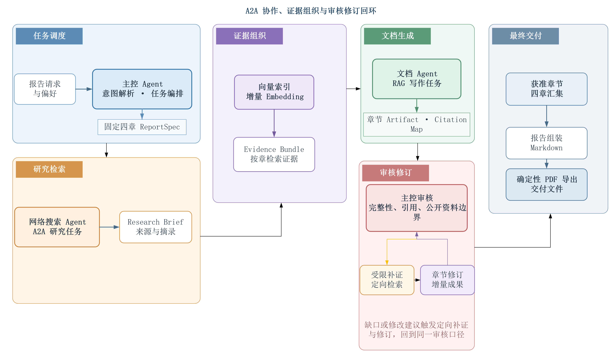

# 人工智能现状分析：多智能体互联系统案例

本项目是《智能互联》配套的教学案例。它以“生成一份人工智能现状分析报告”为任务，将自然语言意图识别、Agent-to-Agent 协作、工具调用、证据检索、向量检索、章节写作、审核修订和确定性 PDF 导出放进一条可运行的任务链。

系统面向教学演示与机制学习。一次真实运行会调用外部模型、检索和向量服务，请使用自己的 API 凭证，并注意相应费用。

## 系统能力

- 主控、网络搜索、文档生成三个 Agent 分工协作。
- 主控通过模型识别报告请求、闲聊与超出能力范围的输入；报告任务可收集写作风格和使用场景偏好。
- 网络搜索 Agent 通过 A2A 协议接收检索任务，调用 Tavily MCP 获取公开资料并交付结构化证据。
- 文档 Agent 通过 A2A 协议接收章节任务，从 Chroma 向量索引检索证据，生成带引文映射的 Markdown 章节。
- 主控依次组织“背景—现状—趋势—建议”四章，进行完整性校验、审核、受限补证与修订，并组装为完整报告。
- 报告以 Markdown 归档，再由项目内的 Chromium 运行时确定性导出 PDF；无需单独安装 Office、Pandoc 或 LaTeX。
- 每次任务保留 A2A trace、Token 账本、服务日志和最终交付物，便于课堂观察和复现。

## 任务链



任务从报告请求与偏好出发，由主控完成意图解析和四章编排；网络搜索 Agent、证据索引和文档 Agent 依次完成研究、检索与写作。审核发现缺口或修订建议时，会触发定向补证和章节修订，再回到同一审核口径，最终组装并导出 Markdown 与 PDF 报告。


## 环境要求

- Windows 10/11、Python 3.12、[uv](https://docs.astral.sh/uv/)。
- DeepSeek API：对话、写作与审核模型。
- 智谱 GLM API：`embedding-3` 向量模型；配置模板同时保留文档解析接口所需字段。
- Tavily API：公开网页检索。

Chroma、A2A 服务、Playwright Chromium 和其余 Python 依赖均由项目命令管理。Chroma 是本项目的向量数据库，包含在 Python 依赖中，无需另外安装桌面软件。

## 安装与配置

```powershell
git clone https://github.com/SenAHovo/Status-Analysis-of-AI.git
Set-Location Status-Analysis-of-AI

# 创建虚拟环境并安装锁定依赖
uv sync --locked

# 安装 PDF 导出使用的项目内 Chromium 运行时
uv run playwright install chromium

# 创建本地凭证文件
Copy-Item .env.example .env
```

编辑 `.env`，填写以下变量：

```dotenv
DEEPSEEK_API_KEY=
GLM_OCR_API_KEY=
GLM_EMBEDDING_API_KEY=
TAVILY_API_KEY=
```

`GLM_OCR_API_KEY` 是当前配置校验要求的凭证槽位；网页报告主链使用 `embedding-3` 建立向量索引。其余地址、模型名和本地 Chroma 配置已有默认值。不要提交 `.env` 或任何真实密钥。完成配置后执行检查：

```powershell
uv run ai-status check-config
```

## 运行教学案例

```powershell
uv run ai-status teach
```

命令会自动启动或复用以下本地服务：Chroma（8000）、网络搜索 Agent（8001）和文档生成 Agent（8002）。随后在终端输入任务，例如：

```text
输出一份人工智能现状分析报告，偏好默认即可
```

若未提供偏好，系统会询问写作风格与使用场景；回复“默认”即可使用公正客观、教学演示的默认配置。终端会输出任务阶段、Agent 协作与交付位置。

成功的运行结果写入：

```text
data/runs/<run_id>__<主题>/
├── reports/report.md
├── reports/report.pdf
├── traces/
└── token_usage.json
```

`data/` 是本地运行目录，默认不纳入 Git。仓库在 [`examples/runs/teach-20260930T071526421985Z__人工智能现状/`](examples/runs/teach-20260930T071526421985Z__人工智能现状/) 保留了一次完整运行的公开快照，包含最终 Markdown/PDF、章节与审核成果、Token 账本、脱敏 trace、服务日志和来源元数据清单，便于不配置 API 时查看完整任务链。快照不包含第三方网页全文、检索摘录或证据正文。

## 项目结构

```text
src/ai_status_report/     主控、Agent、A2A、MCP、RAG、审核与导出实现
config/                   默认配置与任务预算配置
skills/                   证据审核、报告写作、修订的指导资源
scripts/                  密钥审计等辅助脚本
tests/                    单元、集成与端到端离线测试
examples/                 可直接查看的完整运行结果快照
```

## 验证命令

以下命令不触发报告生成所需的付费服务：

```powershell
uv run pytest -q
uv run ruff check .
uv run ai-status check-config
uv run python scripts/audit_secrets.py --mode public
```

`teach` 是真实端到端任务，会调用配置的检索、嵌入、写作和审核服务。检索来源、模型输出与最终报告会随运行时间、外部服务和用户偏好变化。

## 开源许可

本项目采用 [MIT License](LICENSE)。
